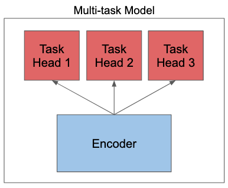

# Pytorch NLP Multitask Learning

<p align="center">
  <a>
    
  </a>
  <a href="https://github.com/aarongrainer/pytorch-nlp-multitask/blob/master/LICENSE">
    
  </a>
</p>

This project showcases the codebase required to train and serve a Pytorch Multitask Natural Learning Processing model using AI Platform with a custom docker container.

## Multitask Learning

Multitask Learning is an approach to inductive transfer that improves generalization by using the domain information contained in the training signals of related tasks as an inductive bias. 



## Installation

[Miniconda](https://docs.conda.io/en/latest/miniconda.html) is recommend, as it allows a minimal installation of python with virtual environment support. After installation, this repo can be run as follows

```shell
git clone git@github.com:AaronGrainer/pytorch-nlp-multitask.git

conda create -n [ENV_NAME] python=3.7

conda activate [ENV_NAME]

pip install -r requirements.txt
```

## Environment Variables

1. Modify the .env file with the desired settings. This file serves to provide an easy access all the modifiable environment variables necessary for training the model.

## Local Run

The Pytorch Transformer Multitask trainer can be run locally first, ideal for development before pushing to the heavylifting cloud resources. Additionaly, the trainer can also be run locally with docker.

To run locally

```shell
make run-local
```

To run locally with docker

```shell
make docker-local-train
```

## Cloud Train

AI Platform Training brings the power and flexibility of TensorFlow, scikit-learn, XGBoost, and custom containers to the cloud. AI Platform Training can be used to train machine learning models using the resources of Google Cloud. 

Custom docker containers will be used here for Pytorch training. 

First, create a GCS bucket to store the trained checkpoint models

```shell
make create-bucket
```

To build and push the docker container to the build registry and launch an AI Platform Training job, run

```shell
make cloud-train
```

## Acknowledgement

Special thanks to [Jason Phang](https://colab.research.google.com/github/zphang/zphang.github.io/blob/master/files/notebooks/Multi_task_Training_with_Transformers_NLP.ipynb) for the HuggingFace multitask code! NLP Multitask learning was way too exciting to pass by.
