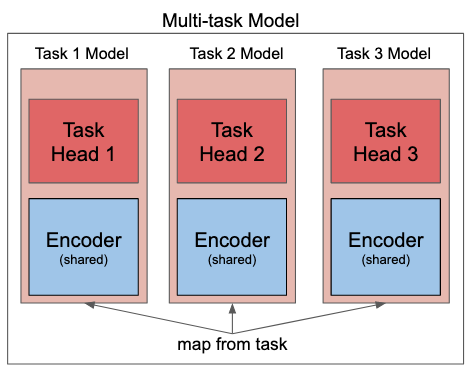

# Pytorch NLP Multitask Learning

<p align="center">
  <a>
    
  </a>
  <a href="https://github.com/aarongrainer/pytorch-nlp-multitask/blob/master/LICENSE">
    
  </a>
</p>

A Pytorch Multi-task Natural Learning Processing model is trained using AI Platform with a custom docker container.

## Multi-task Learning

Multi-task Learning is an approach to inductive transfer that improves generalization by using the domain information contained in the training signals of related tasks as an inductive bias. 

This allows the model to exploit commonalities and differences across tasks, improving efficiency and prediction accuracy for task-specific models, compared to training the models separately. 



Typically, a multi-task model in the age of BERT works by having a shared BERT-style encoder transformer, and different task heads for each task.

Since HuggingFace's Transformers has implementations for single-task models, but not modular task heads, a few library architectural changes are performed. 

1. The Dataloader and Trainer classes from HuggingFace are inherited and method's updated to better suit a multi-task architecture.

2. Separate models will be created for each task with sharing encoders, this allows the encoder to be jointly trained across multiple tasks and existing task-model implementations from Transformers to be used, `RoberaForSequenceClassification` and `RobertaForMultipleChoice`.

## Transformer with AI Platform

- Since AI Platform will be the cloud resource of choice to train the model, some of the Transformer's trainer method has to be updated to upload the training `pt` files to GCS during each training checkpoint. 

## Dataset

To showcase the multi-task NLP learning functionality, three different tasks are chosen:

1. STS-B: A two-sentence textual similarity scoring task.

2. RTE: A two-sentence natural language entailment task.

3. Commonsense QA: A multiple-choice question-answering task.

## Installation

[Miniconda](https://docs.conda.io/en/latest/miniconda.html) is recommend, as it allows a minimal installation of python with virtual environment support. After installation, this repo can be run as follows

```shell
git clone git@github.com:AaronGrainer/pytorch-nlp-multitask.git

conda create -n [ENV_NAME] python=3.7

conda activate [ENV_NAME]

pip install -r requirements.txt
```

## Environment Variables

1. Modify the .env file with the desired settings. This file serves to provide an easy access to all the modifiable environment variables necessary for training the model.

## Local Run

The model can be run locally, ideal for development before offloading to the heavylifting cloud resources. Additionaly, the trainer can also be run locally with docker to better mimic the cloud trainer.

To run locally

```shell
make run-local
```

To run locally with docker

```shell
make docker-local-train
```

## Cloud Train

AI Platform Training brings the power and flexibility of TensorFlow, scikit-learn, XGBoost, and custom containers to the cloud. Custom docker containers will be used here for Pytorch training. 

First, create a GCS bucket to store the trained checkpoint models

```shell
make create-bucket
```

To build and push the docker container to the build registry and launch an AI Platform Training job, run

```shell
make cloud-train
```

## Acknowledgement

Special thanks to [Jason Phang](https://colab.research.google.com/github/zphang/zphang.github.io/blob/master/files/notebooks/Multi_task_Training_with_Transformers_NLP.ipynb) for the HuggingFace multi-task code! I was really excited to put forth my minor contribution in this repo. NLP Multi-task learning was way too exciting to pass up.
